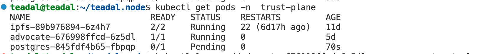
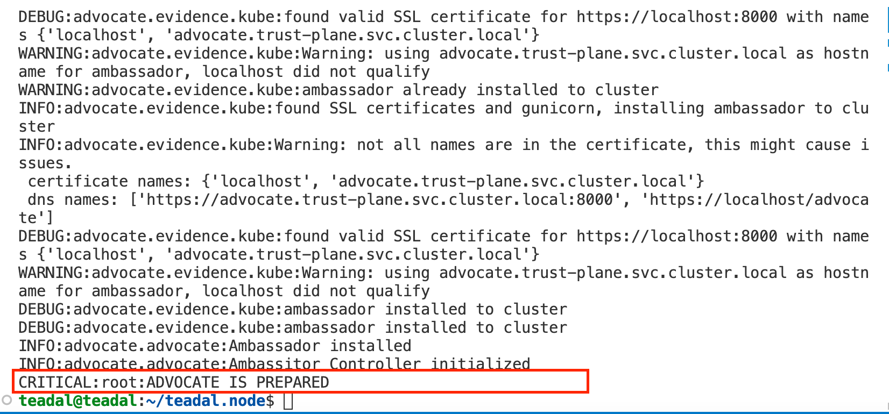

# Teadal tools installation

This document provides a guide to install the tools developed in the TEADAL project. These tools requires a TEADAL node up and running (see [Teadal Node installation guide](QuickStart.md)) 

At this time, the following tools are available:
- [Advocate](#advocate)
- [Catalogue](#catalogue)
- [Policy manager](#policy)
- [AI Driven Performance Monitoring](#AI-DPM)


If any dependencies are indicated, then it is required to configure the ArgoCD project in your Teadal Node to add the required tool.

## Advocate <a name="advocate"/>

#### Dependencies

- Jaeger

See the related [page](InstallAddons.md) to know how to install the dependencies

#### Preliminary steps

Before Advocate will work you will need to create the related namespace
```bash
kubectl create namespace trust-plane
```
Then it is required to configure all needed secrets, variables for Advocate blockchain such as wallet private key, VM key and Ethereum Remote Procedure Call (RPC) Address. For that run this command:
```bash
node.config --microk8s advocate
```
Now you can enter the required values. For the question about the "ADVOCATE_ETH_POA" , enter "1" as value.


#### Tool deployment

Be sure that, **on the repo** the [kustomization file](../deployment/mesh-infra/argocd/projects/plat-infra-services/kustomization.yaml) used by argocd has the line ``- advocate`` uncommented. E.g.:

```bash
apiVersion: kustomize.config.k8s.io/v1beta1
kind: Kustomization

resources:
- project.yaml
- advocate
```

Commit the changes to the repo, thus ArgoCD can fetch the updated configuration. Here an example of the possible list of command needed

```bash
git add deployment/mesh-infra/argocd/projects/plat-infra-services/
git commit -m "enable advocate"
git push
```

After few minutes, ArgoCD will realizes the update and starts deploying the related pods.


#### Checking installation

Check pods that are in Trust-plane namespace:

```bash
kubectl get pods -n trust-plane
```



Check the Advocate pod log to make sure that it is up and running:

```bash
kubectl logs <advocate-pod-name> -n trust-plane
```



## Catalogue deployment <a name="catalog"/>

The deployment of the TEADAL data catalogue requires an approval step. Who is interested in this tool must send an e-mail to XXXX@cefriel.com. In case of acceptance, gitlab credentials will be provided. These credentials are required to properly setup the environment for the deployment 

#### Dependencies

Keycloak and Postgres

#### Preliminary steps

Be sure that the VM on which the catalogue will be installed has a public IP, or it can be reached from the Web. 

First step is to create the secrets to allow microk8s to pull the images from the repository

```bash
kubectl create secret docker-registry teadal-registry-secret -n catalogue \
  --docker-server=https://registry.teadal.ubiwhere.com \
  --docker-username=<gitlab username> \
  --docker-password="<gitlab password>" \
  --docker-email=<gitlab account email> 
```

In case the microk8s notifies that the namespace `catalogue` does not exist, the following command solves the issue:

```bash
kubectl create namespace catalogue
```


#### Tool deployment

Be sure that, **on the repo** the [kustomization file](../deployment/mesh-infra/argocd/projects/plat-app-services/kustomization.yaml) used by argocd has the line ``- catalogue`` uncommented. E.g.:

```bash
apiVersion: kustomize.config.k8s.io/v1beta1
kind: Kustomization

resources:
- project.yaml
- catalogue
```

Commit the changes to the repo, thus ArgoCD can fetch the updated configuration. Here an example of the possible list of command needed

```bash
git add deployment/mesh-infra/argocd/projects/plat-app-services/
git commit -m "enable catalogue"
git push
```

After few minutes, ArgoCD will realizes the update and starts deploying the related pods.

#### Checking installation

In a browser, open the page `http://<host>/catalogue`. A login page to access to the catalog will appear if everything is properly working.

## Policy manager <a name="policy"/>

#### Dependencies

TBD

#### Preliminary steps

TBD

#### Tool deployment

TBD

#### Checking installation

TBD

## AI Driven Performance Monitoring <a name="AI-DPM"/>

#### Dependencies

- Prometheus, Thanos and Kepler

See the related [page](InstallAddons.md) to know how to install the dependencies

#### Preliminary steps

TBD

#### Tool deployment

TBD

#### Checking installation

TBD