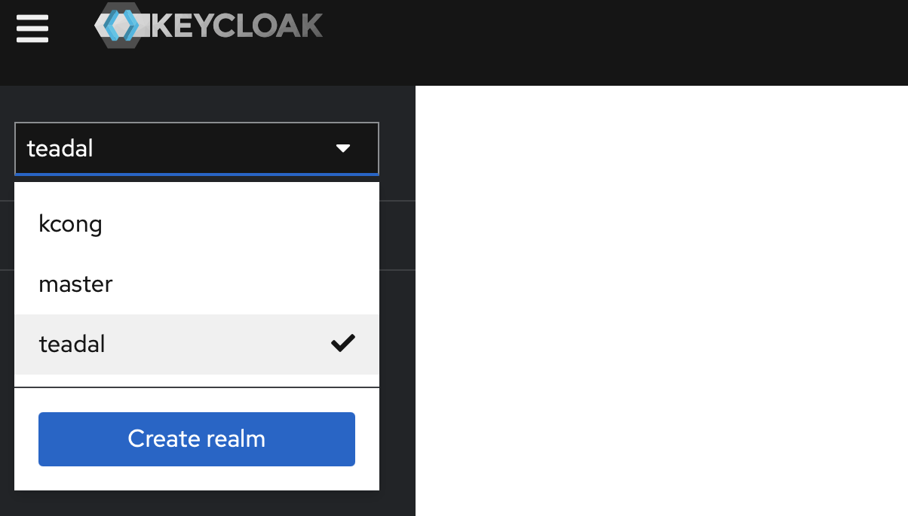
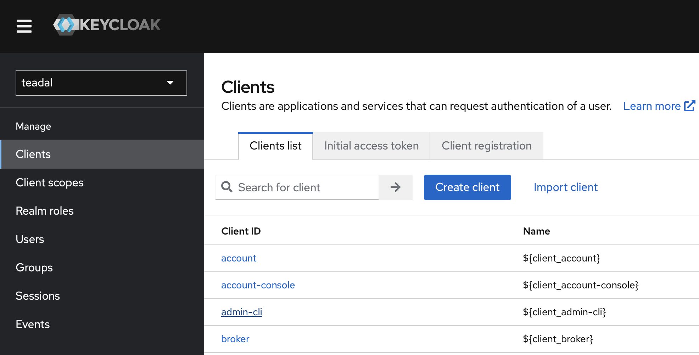
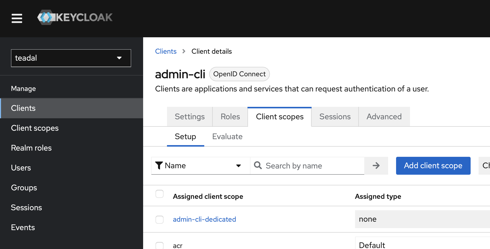
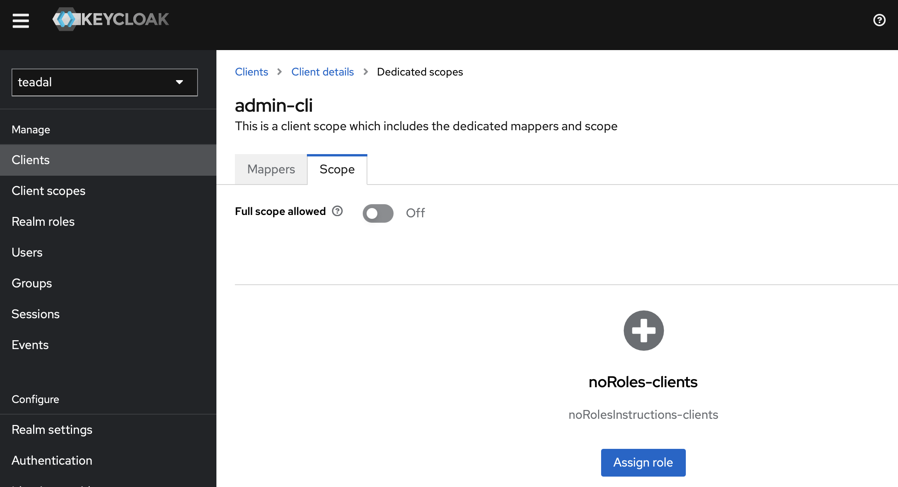
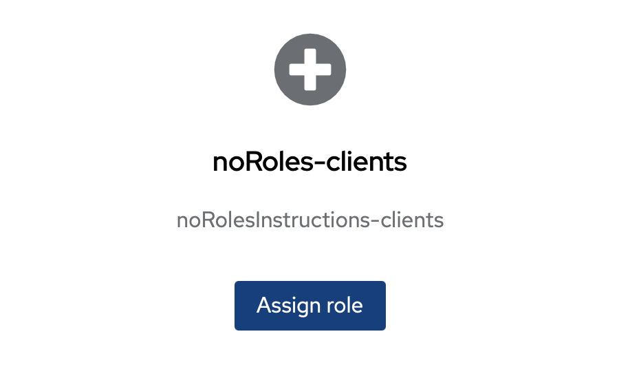
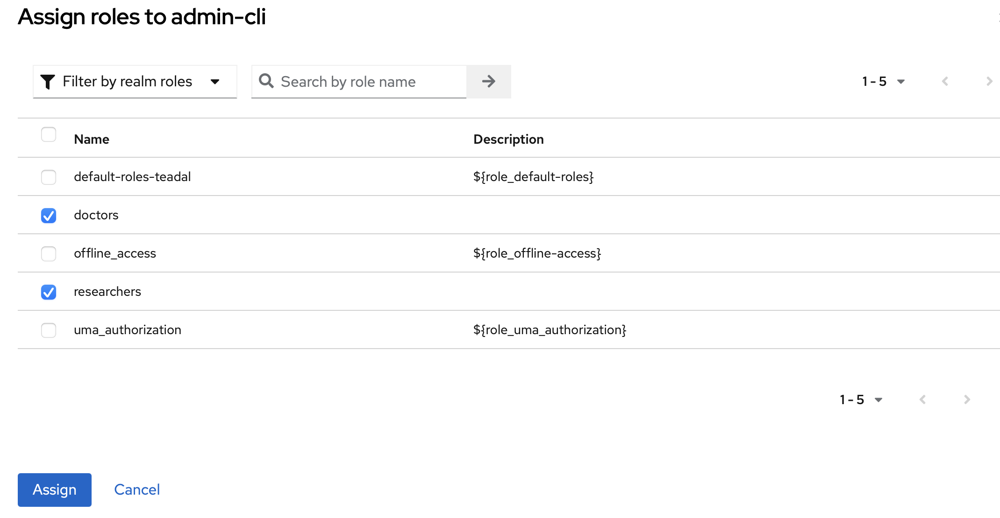
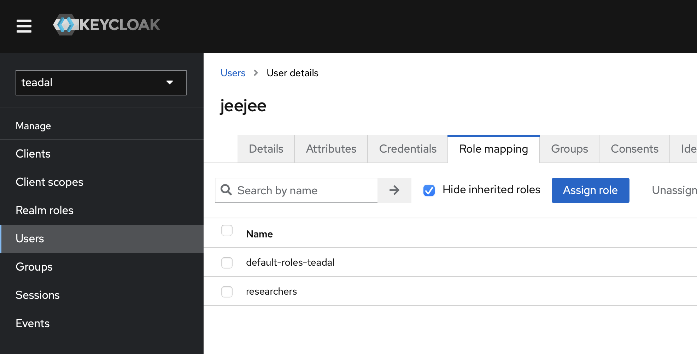

# Configure Keycloak to include role information in JWT

In case you need to specify access controls based on the roles and not only on the username, Keycloak must be configured to include the roles information in the released JWTs.

If you do not have already defined your roles, please have a look to the [official guide](https://www.keycloak.org/docs/latest/server_admin/index.html#assigning-permissions-using-roles-and-groups). Notably, the paragraphs "Creating a realm role" and "Assigning role mappings".

Once the roles have been defined, follow these steps:

1) Open Keycloak admin page (e.g., http://<node_IP>/keycloak)

2) Select the "teadal" realm

3) Select "Clients" and from the list appearing on the right "admin-cli"

4) Select "Client scopes" panel and from the list "admin-cli-dedicated"

5) Select "Scope" panel 

6) In this panel the set of roles you want to be included in the JWT must be added. If all of them already appear, then no need to do anything. Otherwise, proceed with the next steps

7) To add the roles, click on "Assign roles"

8) Select all the roles you want to expose and click on "Assign"

9) The updated list of roles should appear

